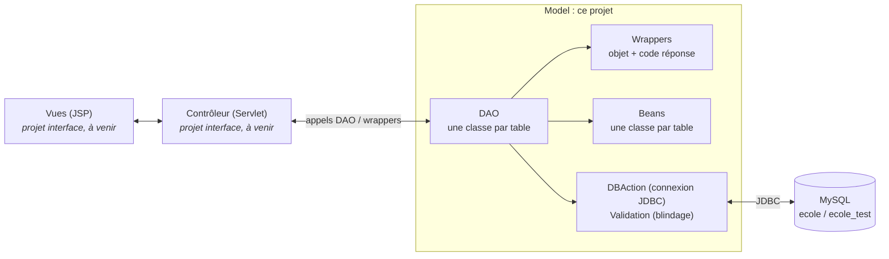
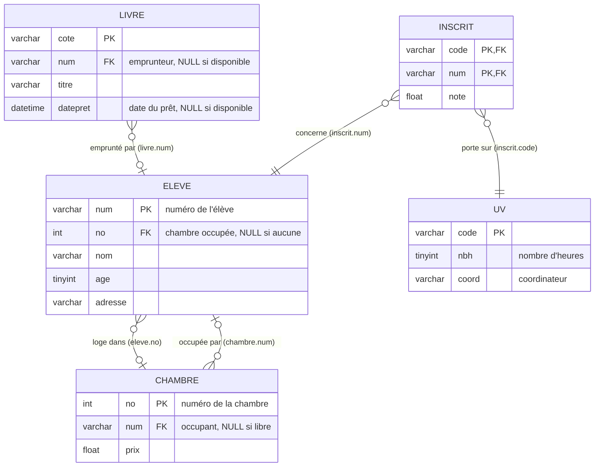
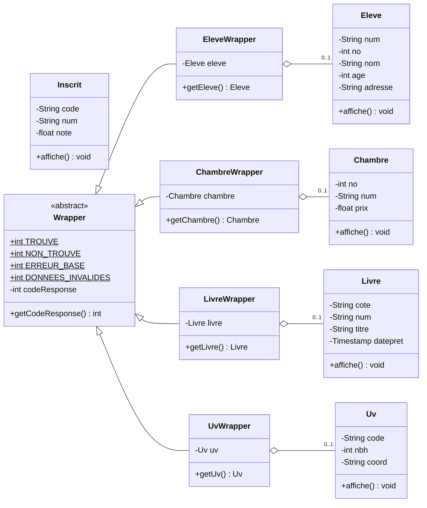
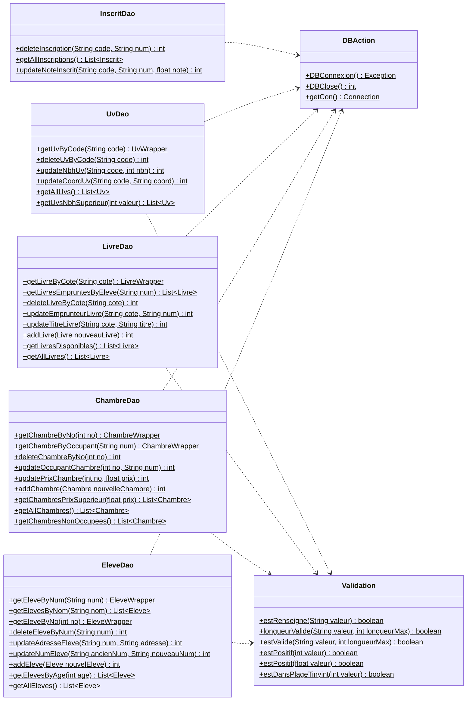

# Document de synthèse — Projet ÉCOLE

**Couche persistance en Java & MySQL** · DEV9 CREA, année 2026-2027 · Encadrant : Taha RIDENE · Auteur : Matis

---

## Sommaire

1. [Sujet](#1-sujet)
2. [Architecture](#2-architecture)
3. [Base de données](#3-base-de-données)
4. [Diagramme de classes](#4-diagramme-de-classes)
5. [Couverture de la spécification fonctionnelle](#5-couverture-de-la-spécification-fonctionnelle)
6. [Codes retour et wrappers](#6-codes-retour-et-wrappers)
7. [Blindage des données](#7-blindage-des-données)
8. [Tests unitaires](#8-tests-unitaires)
9. [Installation et lancement](#9-installation-et-lancement)
10. [Limites connues et pistes d'amélioration](#10-limites-connues-et-pistes-damélioration)

---

## 1. Sujet

Développer la **couche persistance** (le « Model » du MVC2) d'une application de gestion d'école :

- concevoir et créer la base **École** sous MySQL à partir d'un script SQL ;
- écrire une application Java d'accès aux données via **JDBC** :
  - une classe de **connexion** à la base,
  - un **bean** par table (classe représentant une ligne de la table),
  - un **DAO** (*Data Access Object*) par bean, dont les méthodes satisfont la spécification fonctionnelle ;
- valider les classes par des **tests unitaires**.

---

## 2. Architecture

Ce projet constitue la couche **Model** d'une architecture MVC2 / 3-tiers. Les vues (JSP) et le contrôleur (Servlet) feront l'objet d'un projet « interface » séparé, qui appellera les DAO de ce projet.



### Organisation du code

| Package | Contenu |
|---|---|
| `com.crea.jee.beans` | `Eleve`, `Chambre`, `Livre`, `Uv`, `Inscrit` : une classe par table |
| `com.crea.jee.dao` | `EleveDao`, `ChambreDao`, `LivreDao`, `UvDao`, `InscritDao` : accès aux données |
| `com.crea.jee.wrappers` | `Wrapper` et `EleveWrapper`, `ChambreWrapper`, `LivreWrapper`, `UvWrapper` : objet + code réponse |
| `com.crea.jee.utils` | `DBAction` (connexion, fournie par l'encadrant), `Validation` (contrôle des données) |
| `com.crea.jee.junit` | Tests unitaires JUnit 5, un fichier par DAO, plus `ValidationTest` |
| `com.crea.jee.test` | Tests manuels (`main`) qui affichent les résultats dans la console |

Toutes les requêtes passent par des `PreparedStatement` : les valeurs saisies ne sont jamais concaténées dans le SQL, ce qui protège contre l'injection SQL.

---

## 3. Base de données

Modèle relationnel de la base `ecole` (script [`data/ecole.sql`](../data/ecole.sql), qui crée et remplit la base). La base de test `ecole_test` ([`data/ecole_test.sql`](../data/ecole_test.sql)) a exactement le même schéma, sans données.



### Points à noter sur les contraintes

- **Clés étrangères `ON UPDATE CASCADE`** : renommer un élève (`updateNumEleve`) met automatiquement à jour `chambre.num`, `livre.num` et `inscrit.num`.
- **Aucune clé étrangère n'a de `ON DELETE`** : MySQL refuse de supprimer une ligne encore référencée. Les suppressions concernées sont donc gérées dans les DAO, par une **transaction** (tout passe ou rien ne passe) :

| Méthode | Ce que fait la transaction avant la suppression |
|---|---|
| `EleveDao.deleteEleveByNum` | libère sa chambre (`num = NULL`), rend ses livres (`num` et `datepret = NULL`), supprime ses inscriptions |
| `ChambreDao.deleteChambreByNo` | détache les élèves rattachés (`eleve.no = NULL`) |
| `UvDao.deleteUvByCode` | supprime les inscriptions à cette UV |

- **`eleve.no` et `chambre.num` se référencent mutuellement.** Les deux colonnes sont indépendantes : `ChambreDao.updateOccupantChambre` renseigne `chambre.num`, mais aucune méthode de la spécification ne renseigne `eleve.no`.

---

## 4. Diagramme de classes

Les getters et setters des beans ne sont pas représentés. Les méthodes soulignées sont statiques.

### Beans et wrappers



### DAO et utilitaires



Chaque DAO crée les beans de sa table (méthode privée `mapResultSet`) et, pour la lecture d'un objet unique, le wrapper correspondant.

---

## 5. Couverture de la spécification fonctionnelle

Toutes les fonctionnalités de la spécification sont implémentées, y compris les parties optionnelles (UV et Inscrit).

### Élève (indispensable)

| Spécification | Méthode |
|---|---|
| Récupérer un élève par son numéro | `EleveDao.getEleveByNum` |
| Récupérer un élève par son nom | `EleveDao.getElevesByNom` (liste : plusieurs élèves peuvent porter le même nom) |
| Récupérer un élève par son numéro de chambre | `EleveDao.getEleveByNo` |
| Supprimer un élève par son numéro | `EleveDao.deleteEleveByNum` |
| Mettre à jour l'adresse d'un élève | `EleveDao.updateAdresseEleve` |
| Mettre à jour le numéro d'un élève | `EleveDao.updateNumEleve` |
| Ajouter un nouvel élève | `EleveDao.addEleve` |
| Récupérer les élèves ayant le même âge | `EleveDao.getElevesByAge` |
| Récupérer la liste de tous les élèves | `EleveDao.getAllEleves` |

### Chambre (indispensable)

| Spécification | Méthode |
|---|---|
| Récupérer une chambre par son numéro | `ChambreDao.getChambreByNo` |
| Récupérer une chambre par son occupant | `ChambreDao.getChambreByOccupant` |
| Supprimer une chambre par son numéro | `ChambreDao.deleteChambreByNo` |
| Mettre à jour l'occupant d'une chambre | `ChambreDao.updateOccupantChambre` |
| Mettre à jour le prix d'une chambre | `ChambreDao.updatePrixChambre` |
| Ajouter une nouvelle chambre | `ChambreDao.addChambre` |
| Récupérer les chambres au-dessus d'un prix | `ChambreDao.getChambresPrixSuperieur` |
| Récupérer la liste de toutes les chambres | `ChambreDao.getAllChambres` |
| Récupérer la liste des chambres non occupées | `ChambreDao.getChambresNonOccupees` |

### Livre (indispensable)

| Spécification | Méthode |
|---|---|
| Récupérer un livre par sa cote | `LivreDao.getLivreByCote` |
| Récupérer les livres prêtés à un élève | `LivreDao.getLivresEmpruntesByEleve` |
| Supprimer un livre par sa cote | `LivreDao.deleteLivreByCote` |
| Mettre à jour l'emprunteur d'un livre | `LivreDao.updateEmprunteurLivre` (renseigne aussi la date de prêt, ou la remet à NULL au retour) |
| Mettre à jour le titre d'un livre | `LivreDao.updateTitreLivre` |
| Ajouter un nouveau livre | `LivreDao.addLivre` |
| Récupérer les livres disponibles | `LivreDao.getLivresDisponibles` |
| Récupérer la liste de tous les livres | `LivreDao.getAllLivres` |

### UV (optionnel)

| Spécification | Méthode |
|---|---|
| Récupérer une UV par son code | `UvDao.getUvByCode` |
| Supprimer une UV par son code | `UvDao.deleteUvByCode` |
| Mettre à jour le nombre d'heures d'une UV | `UvDao.updateNbhUv` |
| Mettre à jour le coordinateur d'une UV | `UvDao.updateCoordUv` |
| Récupérer la liste de toutes les UV | `UvDao.getAllUvs` |
| Récupérer les UV au-dessus d'un nombre d'heures | `UvDao.getUvsNbhSuperieur` |

### Inscrit (optionnel)

| Spécification | Méthode |
|---|---|
| Supprimer l'inscription d'un élève à une UV | `InscritDao.deleteInscription` |
| Récupérer toutes les inscriptions | `InscritDao.getAllInscriptions` |
| Mettre à jour la note d'un élève à une UV | `InscritDao.updateNoteInscrit` |

---

## 6. Codes retour et wrappers

### Le problème

Une méthode qui renvoie directement un `Eleve` ne peut exprimer que deux situations : l'élève, ou `null`. Or `null` peut vouloir dire « élève inexistant » comme « la base ne répond pas ». Le contrôleur ne peut donc pas savoir quoi afficher à l'utilisateur.

### La solution : les wrappers

Les méthodes qui lisent **un seul objet** renvoient un **wrapper**, qui enveloppe l'objet avec un **code réponse** :

| Code | Constante | Signification | Objet contenu |
|---|---|---|---|
| `1` | `Wrapper.TROUVE` | l'objet a été trouvé | l'objet |
| `0` | `Wrapper.NON_TROUVE` | aucun objet ne correspond | `null` |
| `-1` | `Wrapper.ERREUR_BASE` | erreur côté serveur (connexion impossible ou requête en échec) | `null` |
| `-3` | `Wrapper.DONNEES_INVALIDES` | paramètre invalide (vide, numéro à 0…), refusé sans interroger la base | `null` |

Exemple d'utilisation par un futur contrôleur :

```java
EleveWrapper resultat = EleveDao.getEleveByNum("AGUE001");
switch (resultat.getCodeResponse()) {
    case Wrapper.TROUVE -> afficher(resultat.getEleve());
    case Wrapper.NON_TROUVE -> afficherErreur("Élève introuvable");
    case Wrapper.DONNEES_INVALIDES -> afficherErreur("Numéro invalide");
    default -> afficherErreur("Service indisponible, réessayez plus tard");
}
```

### Écritures (ajout, mise à jour, suppression)

Elles renvoient un `int` :

| Valeur | Signification |
|---|---|
| `1` (ou plus) | nombre de lignes modifiées |
| `0` | aucune ligne concernée (objet non trouvé) |
| `-1` | erreur SQL |
| `-2` | clé déjà existante (ajout ou renommage vers une clé déjà prise) |
| `-3` | données invalides, refusées avant tout accès à la base |

Le cours associe `-1`, `-2` et `-3` à des erreurs « 501 », « 505 » et « 404 ». Ce projet leur donne un sens précis lié aux cas réellement rencontrés, en gardant les mêmes valeurs. Le code `-2` n'existe pas en lecture, puisqu'une lecture ne peut pas créer de doublon.

### Lectures de listes

Elles renvoient une **liste vide** si rien ne correspond (jamais `null`).

---

## 7. Blindage des données

La classe `Validation` contrôle les données **avant** tout accès à la base. Une donnée refusée renvoie le code `-3` sans ouvrir de connexion.

| Contrôle | Règle |
|---|---|
| `estRenseigne` | chaîne non nulle et non vide (les espaces seuls sont refusés) |
| `longueurValide` | longueur inférieure ou égale à la taille de la colonne `varchar` |
| `estValide` | `estRenseigne` et `longueurValide` à la fois |
| `estPositif` | nombre strictement positif (entier ou décimal) |
| `estDansPlageTinyint` | valeur comprise entre -128 et 127 (colonnes `tinyint`) |

Règles appliquées par les DAO :

| Donnée | Règle |
|---|---|
| Numéro d'élève, cote, code d'UV | renseigné, 100 caractères maximum |
| Nom d'élève | renseigné, 50 caractères maximum |
| Adresse | 200 caractères maximum (renseignée lors d'une mise à jour) |
| Âge, nombre d'heures | strictement positif, au plus 127 (`tinyint`) |
| Numéro et prix de chambre | strictement positifs |
| Titre de livre | renseigné, 100 caractères maximum |
| Coordinateur d'UV | 255 caractères maximum |

---

## 8. Tests unitaires

### Une base de test séparée

Comme le recommande le cours, les tests ne touchent jamais la base de production :

| Base | Usage | Sélection |
|---|---|---|
| `ecole` | données de démonstration, utilisée par l'application | par défaut |
| `ecole_test` | même schéma, vide, réservée aux tests | `-Ddb.name=ecole_test` au lancement de la JVM |

Par sécurité, les tests **refusent de démarrer** si `-Ddb.name=ecole_test` n'est pas passé, pour ne jamais vider la vraie base par erreur.

### Une pile de test indépendante des données

Chaque test suit le schéma `@BeforeEach` → test → `@AfterEach` (équivalent JUnit 5 de `@Before` / `@After`) :

- **avant** : les tables sont vidées, et le test insère lui-même les données dont il a besoin ;
- **après** : les tables sont de nouveau vidées, pour ne rien laisser derrière soi.

Les tests ne dépendent donc ni du contenu initial de la base, ni de leur ordre d'exécution.

### Contenu

Chaque test porte une description qui commence par **[OK]** (cas valide, l'opération doit réussir) ou **[ERREUR]** (cas invalide : le DAO doit refuser ou ne rien trouver).

| Classe de test | Tests | Couverture |
|---|---|---|
| `EleveDaoTest` | 22 | toutes les méthodes, suppression en cascade, codes du wrapper |
| `ChambreDaoTest` | 19 | toutes les méthodes, détachement de l'élève à la suppression, codes du wrapper |
| `LivreDaoTest` | 17 | toutes les méthodes, date de prêt à l'emprunt et au retour, codes du wrapper |
| `UvDaoTest` | 14 | toutes les méthodes, suppression des inscriptions liées, codes du wrapper |
| `InscritDaoTest` | 7 | toutes les méthodes |
| `ValidationTest` | 12 | chaque contrôle, sans base de données |
| **Total** | **91** | **91 réussis** |

---

## 9. Installation et lancement

### Prérequis

- JDK 11 ou plus récent (développé et testé avec OpenJDK 25)
- Docker Desktop (pour MySQL) ou un MySQL local sur le port 8889

Les bibliothèques sont fournies dans [`lib/`](../lib) : le driver `mysql-connector-j` et `junit-platform-console-standalone`.

### Démarrer la base

```bash
docker compose up -d
```

Ce fichier [`docker-compose.yml`](../docker-compose.yml) démarre :
- **MySQL 8.4** sur le port **8889**, avec les bases `ecole` et `ecole_test` créées automatiquement à partir des scripts SQL ;
- **phpMyAdmin** sur http://localhost:8091 (utilisateur `root`, sans mot de passe).

### Ouvrir le projet

- **IntelliJ IDEA** : ouvrir le dossier, le fichier `GestionEcole.iml` déclare déjà les bibliothèques de `lib/`.
- **Eclipse** : créer un projet Java sur ce dossier, puis ajouter les deux fichiers `.jar` de `lib/` au *Build Path*.

### Lancer les tests

- **IntelliJ / Eclipse** : clic droit sur le package `com.crea.jee.junit` puis *Run*, en ajoutant `-Ddb.name=ecole_test` dans les *VM options*.
- **Ligne de commande** (Git Bash sous Windows ; sous Linux ou macOS, remplacer `;` par `:` dans le classpath) :

```bash
javac -encoding UTF-8 -cp "lib/*" -d out $(find src -name "*.java")
```

```bash
java -Ddb.name=ecole_test -cp "lib/*;out" org.junit.platform.console.ConsoleLauncher execute --select-package=com.crea.jee.junit --details=tree
```

---

## 10. Limites connues et pistes d'amélioration

- **Listes non enveloppées** : une liste vide peut signifier « aucun résultat » comme « erreur ». Un wrapper de liste lèverait l'ambiguïté.
- **Écritures sans base disponible** : si MySQL est injoignable, les méthodes d'écriture s'arrêtent sur une exception au lieu de renvoyer `-1` comme les lectures.
- **Connexion unique partagée** : `DBAction` garde une seule connexion statique pour toute l'application. Elle ne supportera pas plusieurs utilisateurs simultanés (front web, tests de performance) : il faudra une connexion par requête, ou un pool de connexions.
- **Pas d'ajout d'UV ni d'inscription** : non demandé par la spécification. Les tests insèrent ces données directement en SQL.
- **`eleve.no` et `chambre.num` non synchronisés** : attribuer une chambre via `updateOccupantChambre` ne met pas à jour `eleve.no`.
